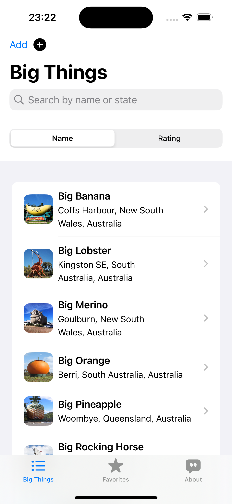
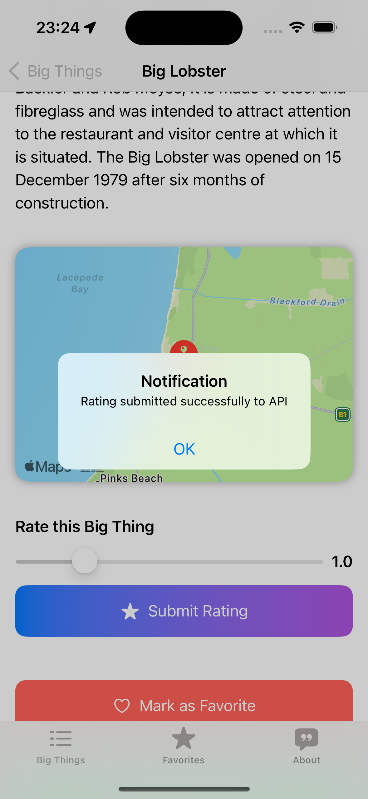
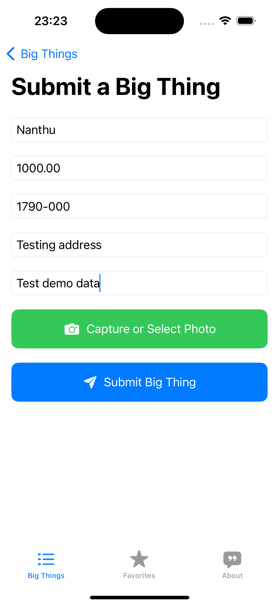

# BigThings iOS App

The **BigThings iOS App** is an application designed to help users discover, rate, and track oversized roadside attractions (Big Things) in Australia. Users can view a list of these attractions, mark them as visited or favorite, rate them, and even submit new Big Things.

## Features

- 📍 **Explore Big Things**: Discover various oversized roadside attractions across Australia.
- ⭐ **Rate Big Things**: Users can rate the attractions and view average ratings from other users.
- ❤️ **Favorites**: Mark your favorite Big Things and keep track of the ones you’ve visited.
- 🗺 **Location Services**: Use GPS to find nearby Big Things and plan your next visit.
- 📷 **Submit New Big Things**: Users can add new entries to the database, including name, location, and a photo.

## App Structure

The project is built using **SwiftUI** and follows the **Model-View-ViewModel (MVVM)** pattern for cleaner code architecture and separation of concerns.

### Key Components

- **BigThingsListView**: Displays the list of Big Things fetched from an online API.
- **BigThingDetailView**: Shows detailed information about a selected Big Thing, including its name, description, and ratings.
- **Core Data Integration**: Locally stores user favorites and visited attractions using Core Data.
- **API Integration**: The app fetches Big Thing data from an external API and allows users to submit new entries.

## Getting Started

To get a local copy up and running, follow these steps:

### Prerequisites

- **Xcode**: You will need Xcode installed on your Mac. [Download Xcode](https://developer.apple.com/xcode/)
- **Cocoapods** (optional): If you are using any external dependencies managed by CocoaPods.

### Installation

1. Clone the repository:
   ```bash
   git clone https://github.com/your-username/BigThingsApp.git
## Screenshots

Here are some screenshots of the **BigThings iOS App**:

### BigThingsListView



### BigThingDetailView



### Add BigThingDetail


